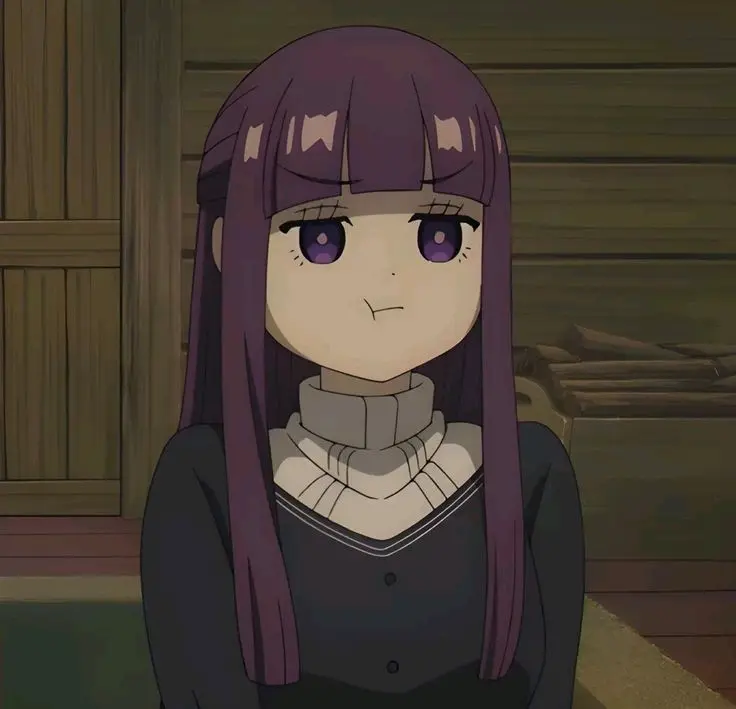

* **经典版本**

|                    图片                     | 角色状态                                           |         Designer         |
|:-----------------------------------------:|---------------------------------------------------|:------------------------:|
|  | 历史产物 | XM |
|                        | 正常登场 |            XM|

* **设计思路及其背景故事**

作为我们班的班长，个性公平公正公开，酷爱打抱不平，还是我们班公认的细胞人，于是设计了一个技能组看起来像[转韩遂](https://sanguosha.fandom.com/zh/wiki/%E9%9F%A9%E9%81%82)的技能组

本意是希望一技能拆牌配合二技能能让打我的人受到反制，如果没人打我，我就让好队友摸牌

<figure markdown="span">
    { width="200"}
    <figcaption>尽管本意美好，但设计出来饱受诟病 :sweat_smile: 。</figcaption>
</figure>

二技能在队友开全体eoe很可能就失去目标了，一技能也很有可能因此发挥不了补牌优势

而且这个角色主要吃轮次，在军八甚至我们线下的军十环境下难以发挥比较不错的表现

但是我还是看好他在短平快的斗地主和龙虎斗（也就是排位2v2）的表现，毕竟收益还算的上稳定

新版本三技能进行了调整，解决了一定问题，让他在军八也有一个还行的补牌技

设计感：``1.5 / 5`` ⭐

强度：``2 / 5`` ⭐

* **谋元神**

然后接下来是元神自己设计的一个角色，福瑞建议开头加上一个谋，加入手杀谋攻篇，我在这里不多评价

|                    图片                     | 角色状态                                                                  |         Designer         |
|:-----------------------------------------:|-----------------------------------------------------------------------|:------------------------:|
|  | 星河璀璨 | 元神 |
