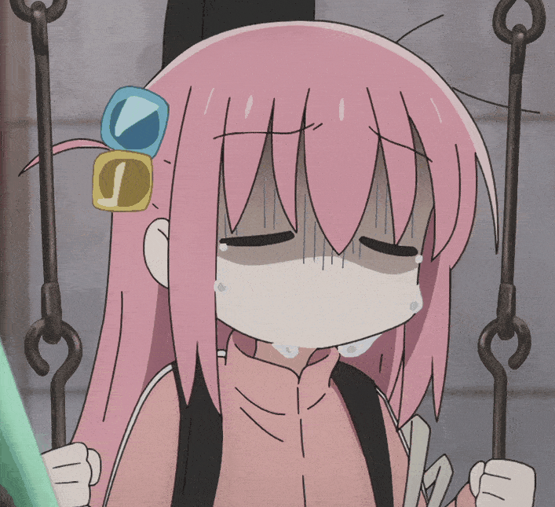

* **经典版本**

|  图片   | 角色状态                                                                 |         Designer         |
|:-----:|----------------------------------------------------------------------|:------------------------:|
|  | 正常登场 | 福瑞 |

* **设计思路及其背景故事**

锐评：神

一直拥有天赋的消愁，这可不比[大狗](20罗锦丰.md)只有开局拥有天赋强多了

作为一个强保核角色，自带四血摸四（当然还能换成手牌上限），保核的同时还能小小的补牌，强度确实不俗，设计出来也不差

因为消愁一滴血的收益往往是决定胜局的，曾经一张[桃园结义](https://wiki.biligame.com/sgs/%E6%A1%83%E5%9B%AD%E7%BB%93%E4%B9%89)在于消愁是否回血的问题上对拍了六张无懈

还是让消愁回上血了，悲

{ width="100"}

在早期环境内就是顶级辅助将，现在还是第一梯队

设计感：``4 / 5`` ⭐

强度：``4 / 5`` ⭐