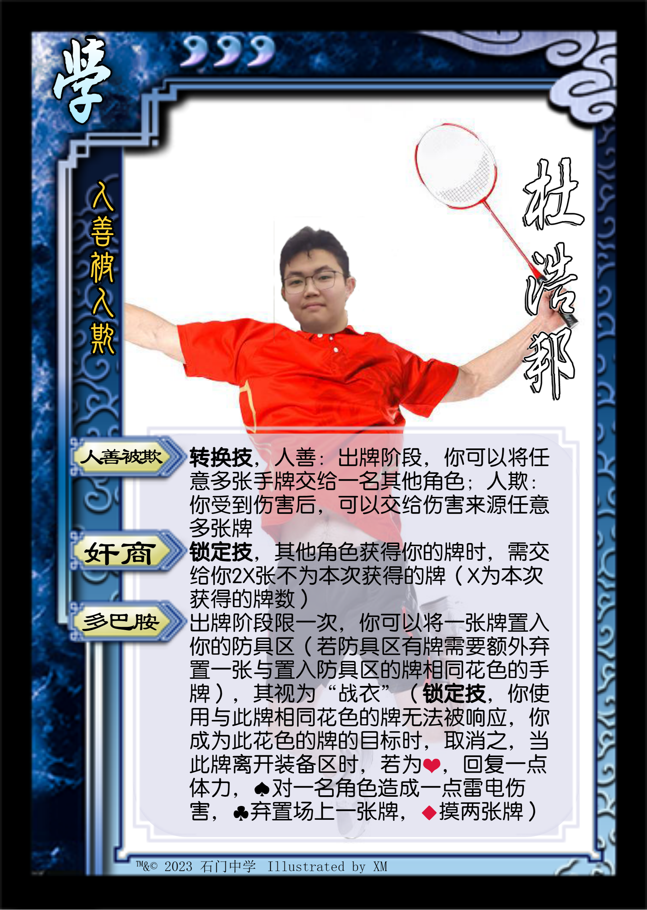

* **经典版本**

|         图片          | 角色状态                                                                 |         Designer         |
|:-------------------:|----------------------------------------------------------------------|:------------------------:|
|  | 历史产物 | XM |
|  | 正常登场 | XM |

* **设计思路及其背景故事**

老版道邦作为传说中阴间将，可以暴捶许多角色，福瑞之前设计了一个评判角色的标准，说爆发，过牌，信息，回复，防御，支援这六个样样不差，妥妥六边形战士（所以之前还减了一点体力上限），最终忍不住压力，大削成为了新版道邦

至于新版道邦，因为我们主要玩的是用间篇，而这里有“赠予”这个操作，只能说现在机制十分吃香，加上多巴胺的过牌和手牌上限，目前还是属于全能型角色，有操作有机制

设计感：``3.5 / 5`` ⭐

强度：``4 / 5`` ⭐