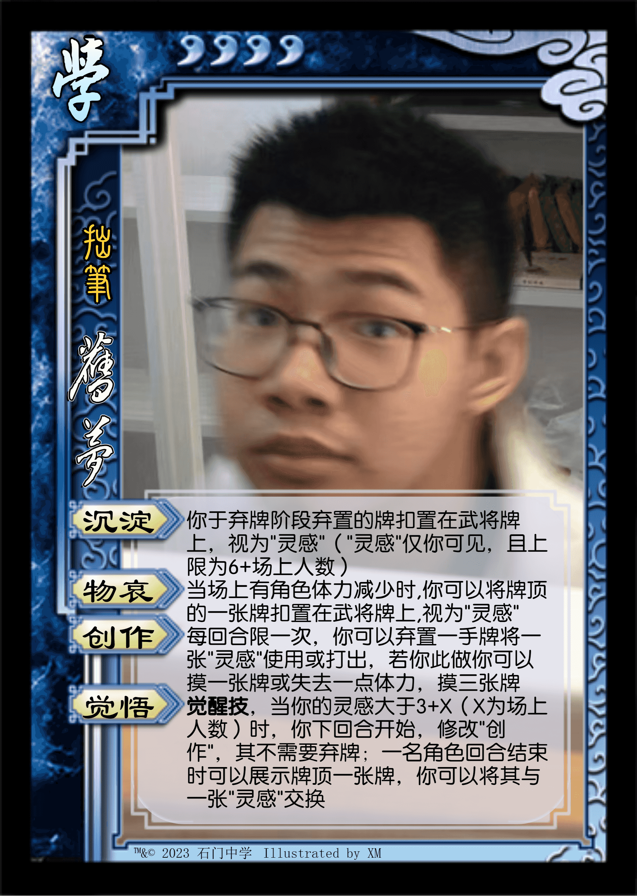

* **经典版本**

本文适合配合音乐食用 ： **貴方の恋人になりたい（想成为你的恋人） - チョーキューメイ**

|          图片           | 角色状态                                                                 |          Designer           |
|:---------------------:|----------------------------------------------------------------------|:---------------------------:|
|  | 历史产物 |  福瑞   |
|    | 正常登场 | 福瑞&XM |

* **设计思路及其背景故事**

关于福瑞的照片，是否应该称呼我一声抓拍狂魔？

最初是福瑞设计的，看起来有点像[星甘宁](https://wiki.biligame.com/msgs/%E6%98%9F%E7%94%98%E5%AE%81)和[界黄盖](https://wiki.biligame.com/sgs/%E7%95%8C%E9%BB%84%E7%9B%96)的混合，虽然里面可以藏不少牌，但我感觉这个设计这不仅卡手（拥有“灵感”标记达到上限后不会再获得，而且还和场上人数挂钩，人数减少了后“灵感”标记的处理有歧义），而且老版作为神·[谯周](https://wiki.biligame.com/msgs/%E8%B0%AF%E5%91%A8)，每回合小观星未免时机有点太多了，托游戏节奏，就按照自己的想法改了改

觉醒后删去了每回合限一次，新版本成为用一摸一神将了，还能控制一名角色的手牌质量（如果放的足够多，两三名角色的手牌也会被控）

但无论新老版本，都有一定的操作难度（也许是小作文难读），而且觉醒前强度较为鸡肋，总之几乎只有本人在玩自己

设计感：``3.5 / 5`` ⭐

强度：``3.5 / 5`` ⭐

* **不堪回首的历史版本**

|          图片          | 角色状态                                                                 |          Designer           |
|:--------------------:|----------------------------------------------------------------------|:---------------------------:|
|  | 历史产物 |  XM   |
|  | 历史产物 | 福瑞 |

“绍”打成“少”了
