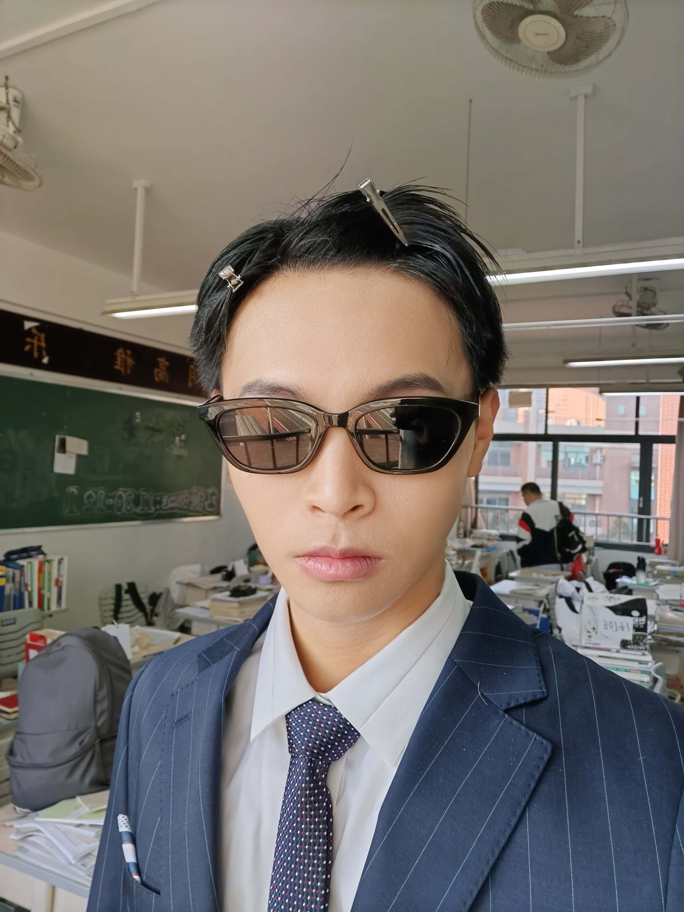

* **经典版本**

本页建议配合音乐使用：

<iframe 
    frameborder="no" border="0" marginwidth="0" 
    marginheight="0" width=330 height=86 
    src="//music.163.com/outchain/player?type=2&id=1358276770&auto=0&height=66">
</iframe>

|         图片          | 角色状态                                                                 |         Designer         |
|:-------------------:|----------------------------------------------------------------------|:------------------------:|
|  | 正常登场 | XM |

* **设计思路及其背景故事**

有人曰：喜欢rap，打王者压力队友的网络男神

不过这张照片真的很好笑，反正当时发出这张照片的时候，班里掀起一阵风波，还造了这个头像的纸币，没找到，放一张原图在这里吧

<figure markdown="span">
    { width="200"}
    <figcaption>豪看</figcaption>
</figure>

关于这个设计其实是不错的，设计完之后发现其实有点像江山如故的[张任](https://sanguosha.fandom.com/zh/wiki/%E5%BC%A0%E4%BB%BB)和手杀[星魏延](https://wiki.biligame.com/msgs/%E6%98%9F%E9%AD%8F%E5%BB%B6)的结合，福瑞说这个是我这些设计里面最有意思的一个

不过很容易【杀】一下然后被【闪】然后就直接空过回合；我曾经问福瑞加强是否一技能（改成其他角色使用【桃】【就】自己都摸牌），不过福瑞认为这样子会让屁眼佬非常非常的逆天，所以就作罢了

设计感：``3.5 / 5`` ⭐

强度：``2 / 5`` ⭐