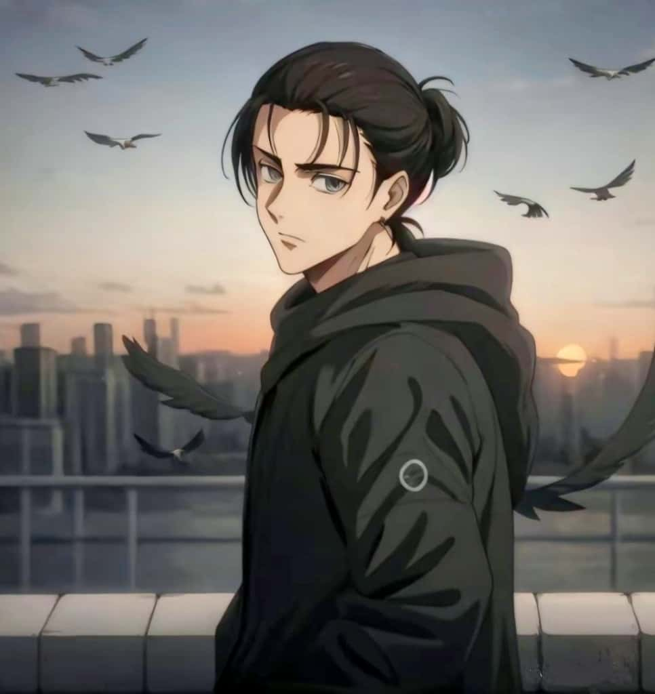
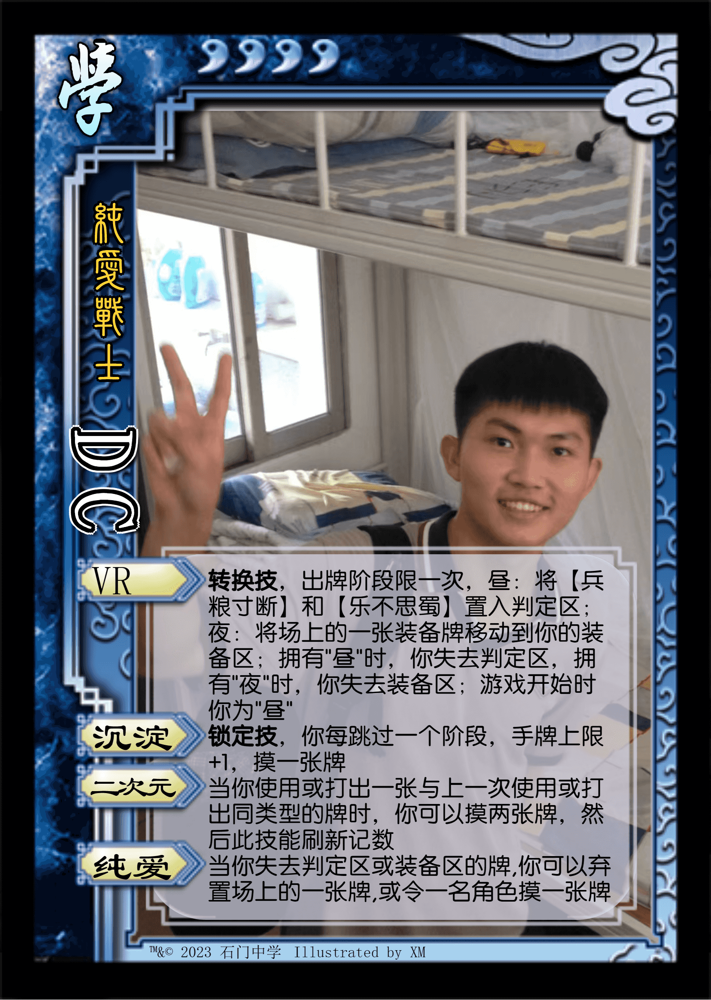
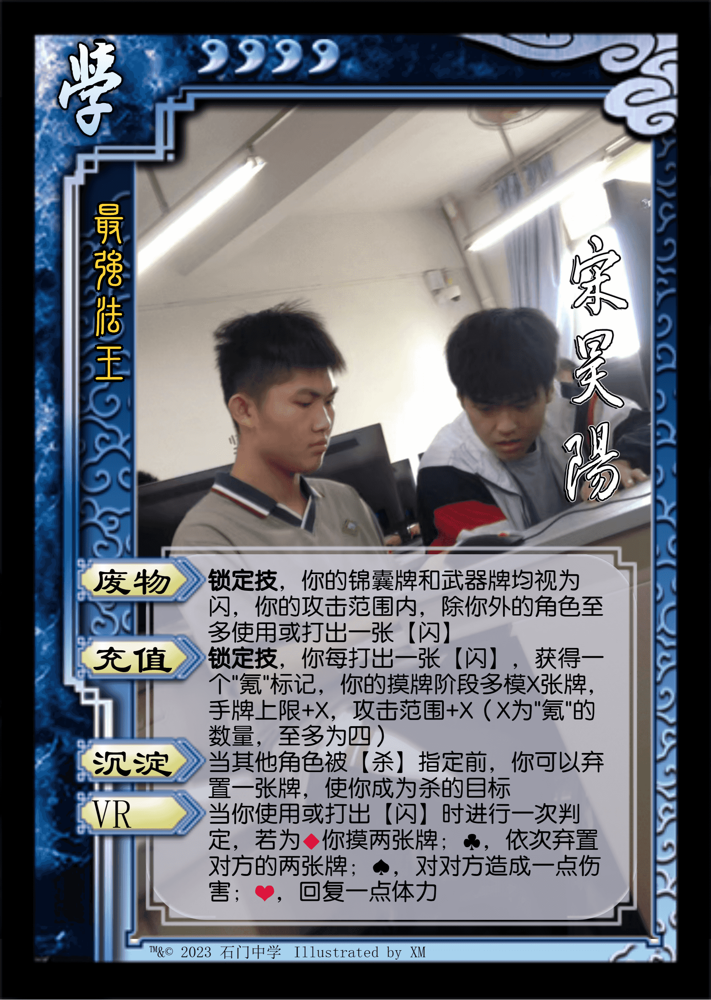
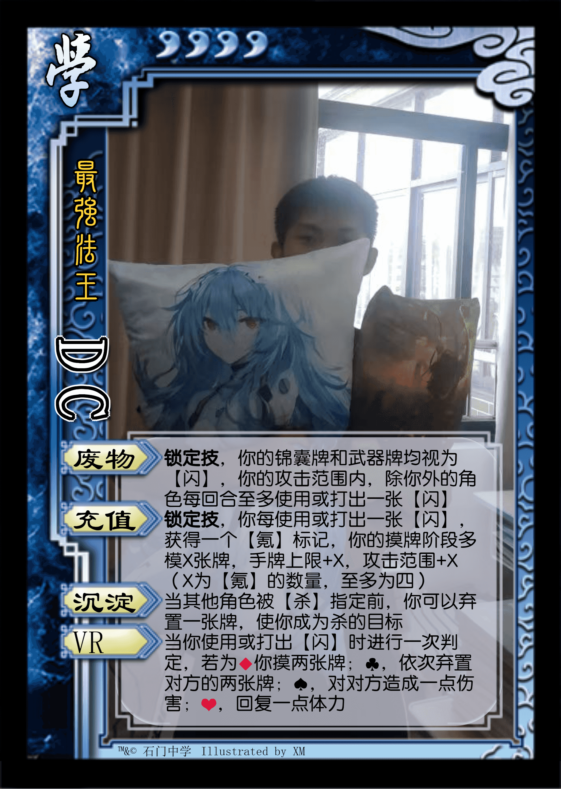

* **经典版本**

本文适合配合音乐食用 ： **Call of Silence - 澤野弘之&R!N/Gemie**

|         图片          | 角色状态                                                                 |         Designer         |
|:-------------------:|----------------------------------------------------------------------|:------------------------:|
|  | 正常登场 | XM |

* **设计思路及其背景故事**

一枚资深二次元，每天去健身房卧推（每餐吃三四十的菜，因为不吃米饭），还是一个霉霉粉，还想留长发盘成艾伦头

<figure markdown="span">
    { width="200"}
    <figcaption>应该是这样吧</figcaption>
</figure>

Buff叠满了属于是

而DC技能设计的思路大有来头

1. DC 曾经在入坑三国杀的时候，有时候看不懂技能，就自己说我不如玩张飞算了

2. DC打5人军争是，当主公玩神周瑜，来了一波双铁索连全场，然后大业炎一波

3. 曾经设计过一个版本的DC携带有【废物】这个技能，是“非基本牌只能当【闪】，可以帮队友使用或打出【闪】”

尽管最终缝合出来的东西不是非常的强，而且还非常吃包养

设计感：``3 / 5`` ⭐

强度：``3 / 5`` ⭐

* **神DC首秀**

|         图片          | 角色状态                                                                 |         Designer         |
|:-------------------:|----------------------------------------------------------------------|:------------------------:|
|  | 神话再临 | 福瑞 |

* **历史上的DC**

|         图片          | 角色状态                                                                  |           Designer           |
|:-------------------:|-----------------------------------------------------------------------|:----------------------------:|
|  | 错误版本 |   福瑞   |
|  | 历史版本  |   福瑞   |
|  | 错误版本 | 一只羊&DC |
|  | 历史版本  |   一只羊&DC   |