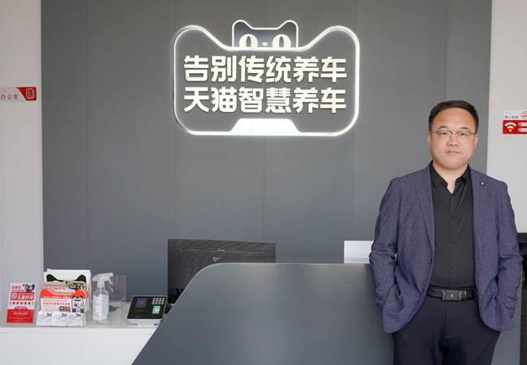
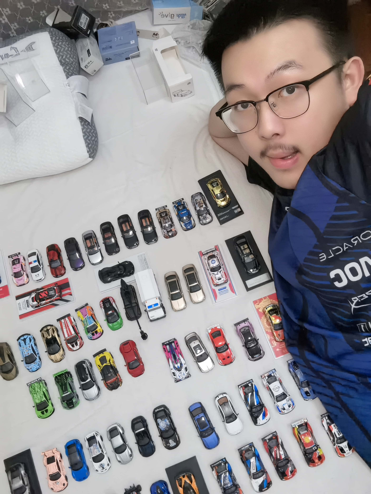
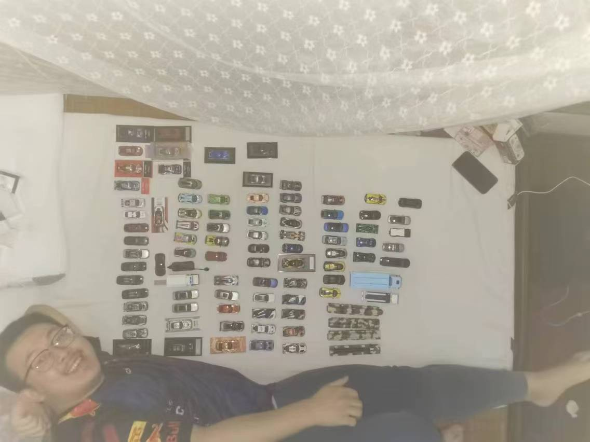

* **经典版本**

|         图片          | 角色状态                                                                 |         Designer         |
|:-------------------:|----------------------------------------------------------------------|:------------------------:|
|  | 正常登场 | XM |

* **设计思路及其背景故事**

<figure markdown="span">
    { width="200"}
    <figcaption>虚假的车库老板</figcaption>
</figure>

<figure markdown="span">
    { width="200"}
    <figcaption>真正的车库老板</figcaption>
</figure>

<figure markdown="span">
    { width="200"}
    <figcaption>全部的库存</figcaption>
</figure>

F1的狂热爱好者，喜欢看足球

不过QT的出租屋不知道接待了多少灵魂需要安慰同学

【车库老板】是一个丢弃防御牌一把梭哈的买车，这对应着现实中QT因为买车时常欠PDD钱

【出租屋】可以邀请好同学亲密交流，可以给团队带来多刀或者无损开【无中生有】或吃【桃】

【爱国】可以有一个不错的团队五谷

设计感：``3 / 5`` ⭐

强度：``3 / 5`` ⭐