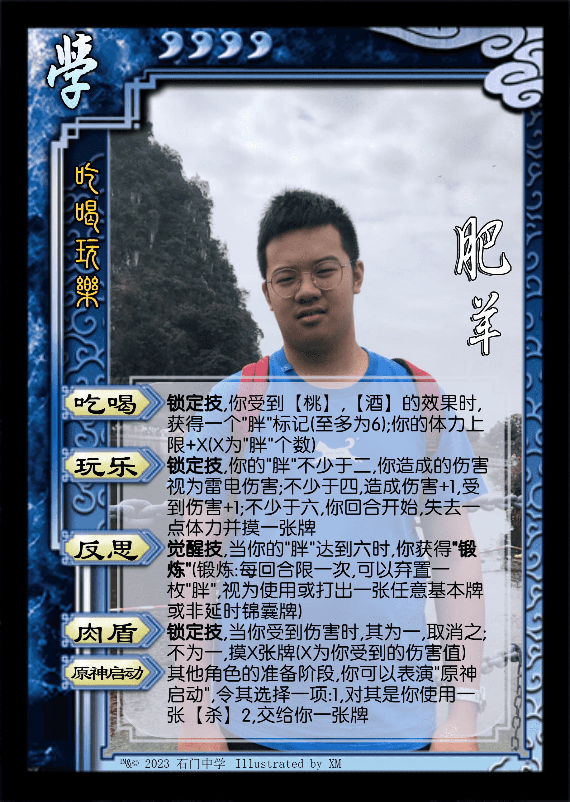

* **经典版本**

|          图片          | 角色状态                                                                 |         Designer          |
|:--------------------:|----------------------------------------------------------------------|:-------------------------:|
|  | 历史产物 | 一只羊 |
|   | 正常登场 | 一只羊 |

* **设计思路及其背景故事**

关于老版YZY，只能说当一个纯肉盾，比[沮授](https://wiki.biligame.com/msgs/%E6%B2%AE%E6%8E%88)还难进去，加上觉醒条件苛刻

所以删去了【肉盾】改成了【暴食】，我自认为不仅相当于有损的【肉盾】并加快了觉醒速度

而觉醒后相当于[神郭嘉](https://wiki.biligame.com/msgs/%E7%A5%9E%E9%83%AD%E5%98%89)，高贵的凭空印锦囊牌，而且还可以在回合外拥有高贵的[看破](https://wiki.biligame.com/msgs/%E5%8D%A7%E9%BE%99%E8%AF%B8%E8%91%9B)，强度不俗，如果自己用这个技能吃【桃】，完全无损

设计感：``3 / 5`` ⭐

强度：``4 / 5`` ⭐

* **三位一体一只羊**

|          图片          | 角色状态                                                                 |         Designer          |
|:--------------------:|----------------------------------------------------------------------|:-------------------------:|
|  | 历史产物 | 一只羊 |

* **设计思路及其背景故事**

强度感觉不错，不过至今我还没搞明白技能组