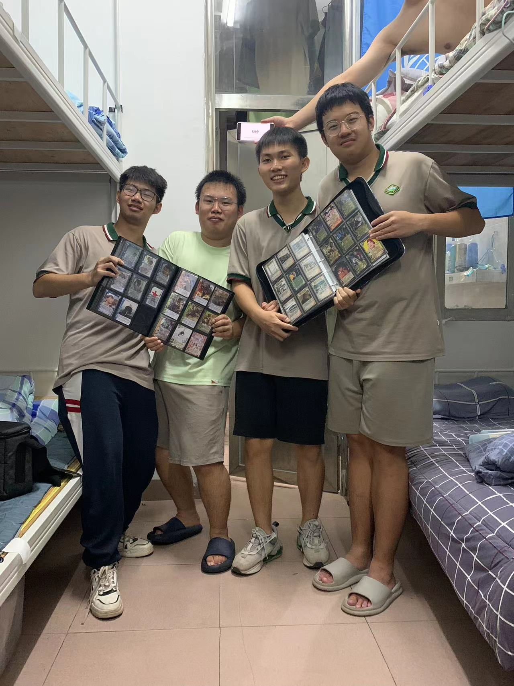
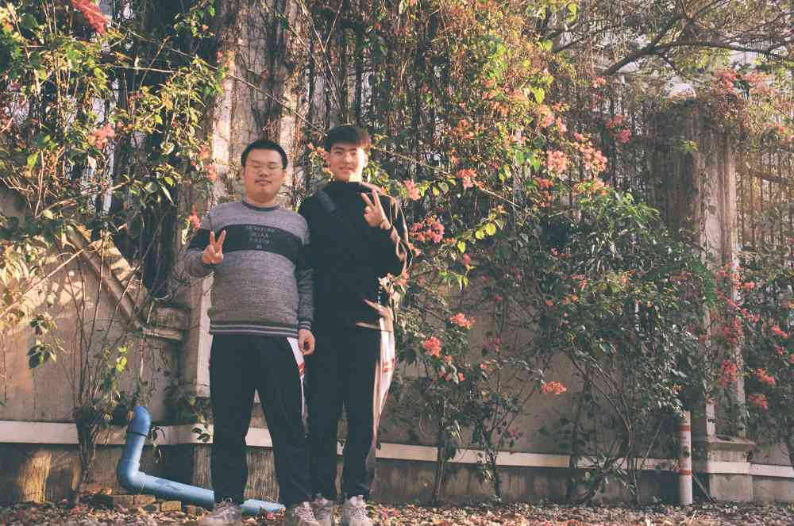

# 欢迎来到石中杀Wiki

**观前须知：本系列为同人设计，不属于商业行为，角色本身和人物事迹并无强关联，角色设计不能客观代表本人，如有冒犯请联系**

本页建议配合音乐使用：

<iframe 
    frameborder="no" border="0" marginwidth="0" 
    marginheight="0" width=330 height=86 
    src="//music.163.com/outchain/player?type=2&id=1340439829&auto=0&height=66">
</iframe>

## 简介

石中杀是由**石门中学学生**基于**三国杀**为基础设计的一系列游戏

角色适配军争篇和用间篇，游戏模式主要为斗地主，龙虎斗2v2，军八，军五（尽管会有军九甚至军十的情况）

特别鸣谢:pray:： 全部支持的好同学和石门中学全部师生

其中主要开发设计者名单：

<figure markdown="span">
    { width="300"}
    <figcaption>四大天王，从左到右依次为：福瑞，XM，DC，一只羊</figcaption>
</figure>

<figure markdown="span">
    { width="300"}
    <figcaption>XM 和 肥喻</figcaption>
</figure>

## Q&A

如果您也想撰写角色评价或者提出问题 :simple-wechat: RioBlus

### Q ：角色状态的种类有什么区别

A：

*  历史产物：曾经的设计，因为过时或者调整了，现在不用了
* 星河璀璨 ：一些由玩家设计出来但强度没有经过评判的
* 神话再临：设计出来就不是用来玩的，当然可以神仙打架，跟[高达一号](https://www.bilibili.com/video/BV1eH4y1e7P5/)和[武诸葛](https://wiki.biligame.com/sgs/%E6%AD%A6%E8%AF%B8%E8%91%9B%E4%BA%AE)掰掰手腕
* 正常登场：现在加入选将池的角色
* 错误版本：技能描述出错了

### Q：如何评价现在石中杀的环境

* A：现在石中杀的环境相当于手杀的阴间场，强度甚至更高一点，但辅助将比较稀缺，大家都是单打独斗，所以现在出的角色一般都往辅助这方面靠近了

### Q：石中杀设计中常常有三国杀的影子

* A：本人XM，喜欢看up [吃蛋挞的折棒](https://space.bilibili.com/8878219)，近几年的三国杀线下产品几乎都买了遍，自然体验了不少三国杀设计的新思路，在设计工期比较赶的情况下（急），或者看到一些有趣的又和人物事迹比较贴切的，就搬运或者加以改造了，不过也有不少是纯属巧合，因为三国杀框架在这里，多刀过牌强命，总不免会遇到“英雄所见略同”，而在设计完后就发现和一些角色有着相似的地方。当然如果你去翻阅福瑞的设计，几乎比较原创。