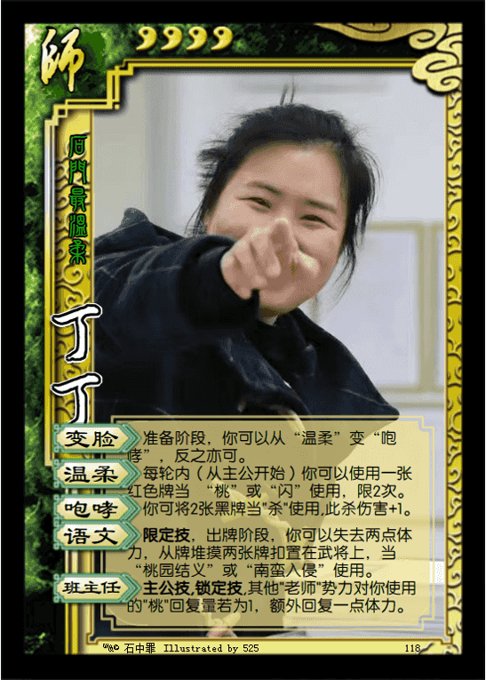
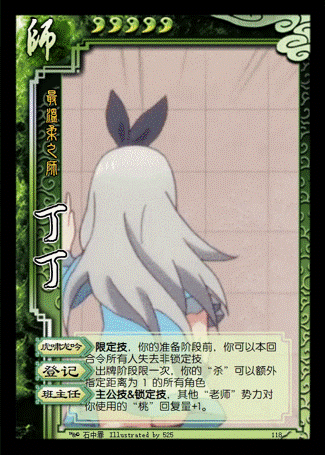
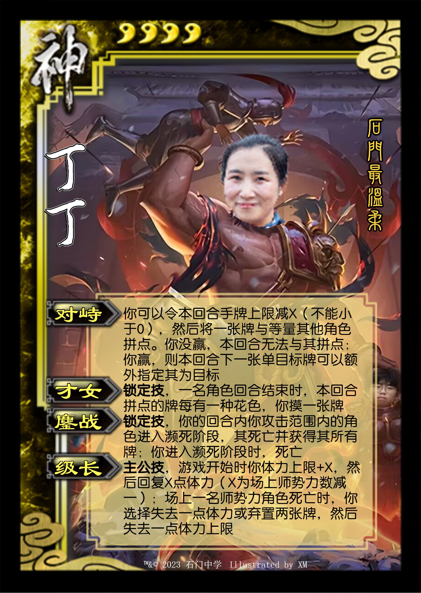

* **经典版本**

|        图片         | 角色状态                                                                 |         Designer         |
|:-----------------:|----------------------------------------------------------------------|:------------------------:|
|  | 正常登场 | XM |

* **设计思路及其背景故事**

石门最温柔的老师丁老师，拥有了最多的设计

设计感：``2 / 5`` ⭐

强度：``3 / 5`` ⭐

* **其他版本**

|         图片          | 角色状态                                                                 |           Designer            |
|:-------------------:|----------------------------------------------------------------------|:-----------------------------:|
|   | 正常登场 |   XM    |
|   | 历史产物 | 李launch |
|   | 历史产物 |   XM    |
|  | 历史产物 |   XM    |
